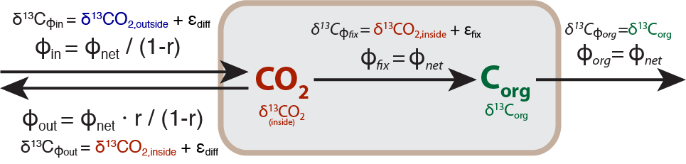

```{r "load packages", include=FALSE}
library(tidyverse)
library(latex2exp)
knitr::opts_chunk$set(eval = FALSE)
```

# 1. Isotope flux at steady-state

The following schematic depicts the overarching metabolic flux diagram typically invoked for C3 type carbon fixation in many plants and photosynthetic microorganisms. Here we will derive the steady-state solution for this system to interrogate the impact of key parameter $r=\frac{\phi_{out}}{\phi_{in}}$ (the ratio of the flux of CO2 into and out of the cell, also known as the reversibility or degree of equilibration of the first step in this reaction network).

```{r, out.width = "100%", echo=FALSE, eval=TRUE}
 
```

## 1A: $C_{org}$ node

Write out the rate of change equations for the $C_{org}$ node and use the assumption of steady-state to find an expression for $\delta^{13}CO_{2,inside}$ as a function of $\delta^{13}C_{org}$ and $\epsilon_{fix}$. *Note: no need to use latex type-setting if you're not familiar with it already, find to just out the equations in regular terms*.
 

$$
\begin{aligned}
 \frac{d[C_{org}]}{dt} &= 
 \\
 \frac{d([C_{org}] \delta^{13}C_{org})}{dt} &= 
 \\
 \rightarrow \delta^{13}CO_{2,inside} &=  
\end{aligned}
$$
 
 
 
## 1B: $CO_{2,inside}$ node
 
Write out the rate of change equations for the $\delta^{13}CO_{2,inside}$ node and use the assumption of steady-state as well as the equation for $\delta^{13}CO_{2,inside}$ derived above, to find an expression for the overall fractionation between the resulting organic material and the isotopic composition of the CO2 outside the cell $\epsilon_{org/CO_2} = \delta^{13}C_org - \delta^{13}CO_{2,outside}$. *Hint: this expression should only be a function of the parameters $\epsilon_{diff}$ (isotopic effect of CO2 diffusion across the membrane), $\epsilon_{fix}$ (isotopic effect of CO2 fixation) and $r$ (the reversibility mentioned earlier); also, with the fluxes already provided in terms of net flux $\phi_{net}$, you will not need the mass flux equation to solve this question.*

$$
\begin{aligned}
  \frac{d[CO_{2,in}] \delta^{13}CO_{2,in}}{dt} &= 
\\
  \rightarrow \epsilon_{org/CO_2} = \delta^{13}C_{org} - \delta^{13}CO_{2,out} &=
\end{aligned}
$$

## 1C: The effects of reversibility

The isotopic effect of diffusion ($\epsilon_{diff}$) at 25 Celsius is -0.7‰ and the typical value for the isotpic effect of carbon fixation ($\epsilon_{fix}$) in marine phytoplankton is -25‰. Calculate the overall isotope effect $\epsilon_{org/CO_2}$ and plot it vs. reversibility `r` (from 0 to 1 or 0% to 100%). Store the resulting data frame in variable `df_1c` (with, at minimum, columns `r` and `eps_org_co2`) and the plot in `p_1c`.

What is the largest and smallest possible isotope effect and how does it relate to reversibility? 

When do you think the two end-members are most likely to occur?


```{r}
df_1c <- 
  data_frame(
    ?
  )

p_1c <- ?
p_1c
```


# 2. Non steady-state systems

The following system simulates a cow eating a meal and then digesting it happily and converting it into biomass, respired CO2 and microbial fermentation products (some of which the cow can use, some of which are just excreeted as microbial biomass and most of which are reworked to CO2 and methane by the microbial community). Here, we are using the custom package `isocyclr` just to make it easier to set up the whole system and run a simulation. All reaction kinetics are modeled as first order kinetics from the precursor pool with the same rate constant `k`.

```{r, message=FALSE, warning=FALSE, fig.width = 10, fig.height = 6, eval = TRUE}
library(isocyclr)

cow <- isopath() %>% 
  add_isotope("d13C") %>% 
  add_component(
    c("food", "assimilable", "fermentable", "animal", "poop", "CO2", "methane"),
    d13C) %>% 
  # food intake
  add_custom_reaction(
    food == 0.4 * assimilable + 0.5 * fermentable + 0.1 * poop, 
    flux = k * food, flux.d13C = food.d13C, name = "1. eating") %>% 
  # assimilable fractoin
  add_custom_reaction(
    assimilable == animal, name = "2. direct assimilation",
    flux = 0.2 * k * assimilable, flux.d13C = assimilable.d13C) %>% 
  add_custom_reaction(
    assimilable == CO2, name = "3. respiration by animal",
    flux = 0.8 * k * assimilable, flux.d13C = assimilable.d13C - 1.5) %>% 
  # fermentable fraction
  add_custom_reaction(
    fermentable == assimilable, name = "4. useful fermentation", 
    flux = 0.1 * k * fermentable, flux.d13C = fermentable.d13C) %>% 
  add_custom_reaction(
    fermentable == CO2, name = "5. respiration by microbes",
    flux = 0.43 * k * fermentable, flux.d13C = fermentable.d13C - 1.5) %>% 
  add_custom_reaction(
    fermentable == methane, name = "6. methanogenesis",
    flux = 0.43 * k * fermentable, flux.d13C = fermentable.d13C - 70) %>% 
  add_custom_reaction(
    fermentable == poop, name = "7. microbial biomass",
    flux = 0.04 * k * fermentable, flux.d13C = fermentable.d13C) 

cow %>% generate_reaction_diagram(add_arrows = T)
```

## 2A: What does the cow system look like?

Based on this reaction schematic and the different flux proportions and isotopic effects indicated in the above reactions, draw a diagram for this system labeling the pools (like in the diagram in the previous problem), the relative fluxes, and the formulas for the isotopic composition of the fluxes. (*Note: name the file `cow_solution.jpg` or `cow_solution.png` - totally sufficient to take a picture of your sketch with an in-focus phone camera and upload the picture into this assignment repository.*).

```{r, out.width = "100%", echo=FALSE, eval=TRUE}
if (file.exists("cow_solution.png"))
  knitr::include_graphics("cow_solution.png")
if (file.exists("cow_solution.jpg"))
  knitr::include_graphics("cow_solution.jpg") 
```

## 2B: Watching the cow eat

Now that the system is set up, we will use it to numerically run through the scenario of feeding the cow with 100 **Moo** (the internationally recognized mass unit for cow food), here represented with setting the initial size of the `food` pool to 100 (note that the other pools can't quite be zero because we'd run into numerical problems simulating the flux from the initial condition but we're setting them to virtually 0 by assigning pool sizes of $10^{-10}$ **Moo**). We're also assuming an isotopic composition of 0‰ starting out and are running the simulation long enough until virtually all of the `food` pool is gone. The following plot illustrates how the individual pool sizes and isotopic compositions change as a function of the `food` pool remaining. Examine the graph and answer the following questions (qualitatively):

 - What do you observe for the pool sizes and isotopic compositions of the `assimilable` and `fermentable` pools? Why would you expect the observed behavior? What process do you see reflected most strongly in the isotopic pattern of the `fermentable` vs. `methane` pools?

 - What do you observe for the pool sizes and isotopic compositions of the `assimilable` and `fermentable` pools? Why would you expect the observed behavior? What process do you see reflected most strongly in the isotopic pattern of the `fermentable` vs. `methane` pools?


```{r, fig.height=8, fig.width=10, echo=FALSE, message=FALSE, eval=TRUE}
cow <- cow %>%
  set_parameters(
    data_frame(
      # rate constant
      k = 0.01,
      # initial pool sizes
      food = 100, assimilable = 1e-10, fermentable = 1e-10, animal = 1e-10,
      poop = 1e-10, CO2 = 1e-10, methane = 1e-10,
      # initial isotopic compositions
      food.d13C = 0, assimilable.d13C = 0, fermentable.d13C = 0, 
      animal.d13C = 0, poop.d13C = 0, CO2.d13C = 0, methane.d13C = 0
    )
  )

# time dependent model
result <- cow %>% 
  run_model(time_steps = 1000) %>%
  # first step is just initial conditions
  filter(time > 1)

bind_rows(
  # combine isotope information
  result %>% 
    gather(pool, value, ends_with("d13C")) %>%
    mutate(pool = sub(".d13C", "", pool), variable = "d13C [permil]"),
  # with the pool sizes
  result %>% 
    gather(pool, value, -time, -k, -food, -ends_with("13C")) %>%
    mutate(variable = "pool size [%]")) %>%
  # plot everything
  ggplot() +
  aes(food / food[1], value, color = pool) +
  geom_line(size = 1) + theme_bw() +
  scale_x_reverse("food remaining", 
                  labels = scales::percent, expand = c(0, 0)) +
  scale_color_manual(breaks = c("food", "assimilable", "fermentable",
                                "CO2", "methane", "animal", "poop"),
                     values = RColorBrewer::brewer.pal(8, "Set2")) +
  facet_wrap(~variable, ncol = 1, scales = "free_y")
```


## 2C: Final pool distributions

The `result` variable holds the output of the simulation (for all 1000 time steps) with the last row (retrieved by `tail(n=1)`, see below) holding the state of the `cow` system at the very end of the simulation. Demonstrate that both mass and isotopic composition are conserved (to 4 decimal places) by calculating the summary columns `mass` and `isotopes` (store in a new data frame called `df_2c`). 

What are the final pool sizes of the products (`CO2`, `methane`, `animal` and `poop`) to 1 decimal place? Show for each of these pools that this result is consistent with the flux partitioning through the reaction network (simple calculations but be mindful of sequential branchpoints and multiple paths contributing to some of these).

```{r}
df_2c <- result %>% 
  tail(n = 1) %>%
  mutate(
    ?
  )  

df_2c
```


# 3. Mass scaling laws and mass-independent isotope effects
 
Isotope effects for systems with more than 2 isotopes usually scale in certain way between multiple isotopes. Usually this scaling number is called the **mass scaling factor** or **coefficient** and designated by the letter $\kappa$, $\lambda$ or (most confusingly) $\beta$. We'll definitely avoid the last one because this is _not_ the same as the reduced partition function ratio and instead settle on $\lambda$ for this exercise (but you may encounter the others in the literature).

If $\alpha$ describes how **2 isotopes** (e.g. $^{16}O$ and $^{18}O$) fractionate in a process, the scaling factor (here $\lambda$) describes how fractionation in that process is related for **3 isotopes** (e.g. $^{16}O$, $^{17}O$, $^{18}O$), usually by relating the fractionation factor for the rarer minor isotope (here, $^{17/16}\alpha$) is related to that of the typical minor isotope ($^{18/16}\alpha$):

$$
^{17/16}\alpha = (^{18/16}\alpha)^\lambda \rightarrow (\delta^{17}O + 1) = (\delta^{18}O + 1)^\lambda
$$

For equilibrium processes, $\lambda$ can be calculated from the ratios of the ratios of the partition function ratios (...so many ratios...), which fortunately simplifies to the following approximation:

$$
\lambda = \frac{\frac{1}{m_1} - \frac{1}{m_2}}{\frac{1}{m_1} - \frac{1}{m_3}}
$$

Where masses 1, 2 and 3 are simply the three isotopes, i.e. for oxygen, $m_1 = 16$, $m_2 = 17$, $m_3 = 18$ and $\lambda_{eq}$=0.5294 

For kinetic processes, however, a better approximation is:

$$
\lambda = \frac{\ln{m_1} - \ln{m_2}}{\ln{m_1} - \ln{m_3}}
$$

which, for oxygen evaluates to $\lambda_{kin}$=0.5147. The equilibrium and kinetic scaling factors are similar but not identical. As a consequence, most environmental processes that are a combination of several steps have a scaling factor somewhere in between. For the process of respiration, for example, $\lambda_{resp}$ is 0.5179 (*Kaiser, 2011: Consistent calculation of aquatic gross production from oxygen triple isotope measurements.*).


## 3A: Scaling factors for sulfur

Using the equations above, write a function each (`calc_eq_scaling` and `calc_kin_scaling`) to calculate predicted equilibrium and kinetic scaling factors and use them to calculate both for sulfur 32, 33, 34 (*Note: sulfur also has a forth isotope 36 so this calculation could also be performed for 32, 36, 34 instead*).

```{r}
# approximation for eq. effects
calc_eq_scaling <- function(m1, m2, m3)  {
  
}

# approximation for kinetic effects
calc_kin_scaling <- function(m1, m2, m3) {
  
} 

calc_eq_scaling(32, 33, 34)
calc_kin_scaling(32, 33, 34)
```

## 3B: Mass-scaling in equilibrium processes

Assume a material with isotopic composition $\delta^{34}S = 0$ and $\delta^{33}S = 0$ is fractionated by different equilibrium processes that have $^{34}\epsilon_{product/reactant}$ values ranging from -60‰ to +60‰ (in steps of 10‰).

Calculate the set of $^{34}\alpha$ and $^{33}\alpha$ fractionation factors that correspond to these $^{34}\epsilon$ values using the exact scaling relation ($^{33}\alpha = (^{34}\alpha)^x$) with x=0.515 (i.e. the scaling factor for equilibrium processes), and apply these fractionation factors to the starting material to calculate the resulting $\delta^{34}S$ and $\delta^{33}S$. Store the result in a data frame named `df_3b` with (at minimum) columns `eps34`, `alpha34`, `alpha33`, `delta34`, and `delta33`. Plot the resulting $\delta^{33}S$ vs. $\delta^{34}S$ values and store the plot in `p_3b`.
 
```{r}
df_3b <- ?
df_3b

p_3b <- ?
p_3b
```

## 3C: Mass-scaling in diverse processes

Most natural processes follow mass scaling laws with scaling coefficients in the range of the predicted kinetic to equilibrium value but there are some (such as quantum tunnling and certain photochemical reactions) that do not. Those are frequently termend mass-'independent' processes, which is a bit misleading because they are often still influenced by the difference in mass between the isotopes, they just don't follow the predicted scaling relationship (i.e. may have a totally different scaling factor from the equilibrium or kinetic one).

The new pools with varying $\delta^{34}S$ (and $\delta^{33}S$) values you just calculated in the previous section (`df_3b`) are now affected by a single second process with fixed $^{34}\epsilon_{product/reactant}$ = 20‰ but in 3 different scaling scenarios. For each scenario, calculate the resulting $^{33}\alpha$ value and apply the $^{34}\alpha$ and $^{33}\alpha$ fractionation factor to the isotopic compositions calculated in the previous section (use the exact formula $\delta_{product} = \alpha_{product/reactant} \cdot (\delta_{reactant} + 1) - 1$ for fractionation, not the $\delta_{product} = \delta_{reactant} + \epsilon_{product/reactant}$ approximation). Again, store the result in data frame `df_3c` with (at minimum) added columns `new_delta34` and `new_delta33`, and plot $\delta^{33}S$ vs. $\delta^{34}S$ for the resulting values with all scenarios on the same plot (store the plot in `p_3c`).
 
   - 1. another equilibrium process with mass scaling factor for sulfur-33 of x=0.515
   - 2. a kinetic process with mass scaling factor for sulfur-33 of x=$\lambda_{kin}$ that you calculated earlier
   - 3. some photolytic process with a scaling factor of 0.950
 
 > Answer:

```{r}
df_3c <- ?
df_3c

p_3c <- ?
p_3c
```


## 3D: Quantifying 'mass-independent' fractionation (MIF) 

Regardless of semantic discussions about the term "mass-indepenent", there needs to be some way to determine whether a sample does or doesn't follow the expected mass scaling law since this can give important hints as to what kind of  processes may have affected the sample. Typically, this is done in several possible ways that all describe a **deviation** from the expected mass scaling law (with the deviation termed capital delta $\Delta^{x}E$, i.e. $\Delta^{17}O$ or $\Delta^{33}S$, *Note: not to be confused with $\Delta_{A/B}$ as an approximation for a fractionation factor!*). The deviation from expection is either defined as the difference between measured and expected delta values, or as the relative difference of observed from expected fractionation factors, i.e., the following two are the commonly used notations (subscripted I and II, respectively, here with the example of sulfur-33 to make it more concrete):

$$
\begin{align}
\Delta^{33}S_I &\equiv \delta^{33}S_{obs} - \delta^{33}S_{expect} = \delta^{33}S_{obs} - ((\delta^{34}S_{obs} + 1)^\lambda - 1) = \delta^{33}S_{obs} + 1 - (\delta^{34}S_{obs} + 1)^\lambda \\
\Delta^{33}S_{II} &\equiv \frac{^{33}\alpha_{obs} - \vphantom{a}^{33}\alpha_{expect}}{^{33}\alpha_{expect}} = \frac{\delta^{33}S_{obs} + 1}{(\delta^{34}S_{obs} + 1)^\lambda} - 1
\end{align}
$$

The second one is frequently cast by taking natural logs and further simplified approximating $\ln (x+1) \approx x$ for $x\ll1$ (similar to what we've seen for fractionation factors), leading to $\Delta$ definitions III and IV (especially IV is a popular simplification you see all the time):

$$
\begin{align}
\Delta^{33}S_{III} &\equiv \ln{(\delta^{33}S_{obs} + 1)} - \lambda \cdot \ln{(\delta^{34}S_{obs} + 1)} \\
\Delta^{33}S_{IV} &\equiv \delta^{33}S_{obs} - \lambda \cdot \delta^{34}S_{obs} 
\end{align}
$$

For each scenario you calculated in part C, calculate and plot the  $\Delta^{33}S$ (*1000 to illustrate in ‰) vs. $\delta^{34}S$ with all 4 definitions of $\Delta$ (use the standard mass scaling for sulfur-33 for the $\Delta$ calculations of $\lambda$ = 0.515). Store the resulting data frame in `df_3d` with (at minimum) new columns `D33_1`, `D33_2`, `D33_3`, `D33_4` (for the 4 definitions) and the plot in `p_3d`. Hin: use `gather(..., starts_with("D33"))` for easy plotting. 

For all 3 scenarios, comment on what you would expect $\Delta^{33}S$ to be (qualitatively, i.e. 0, positive, negative?) and what you observe for the 4 definitions of $\Delta$. Which definitions are problematic to use?

```{r}
df_3d <- ?
df_3d

p_3d <- ?
p_3d
```


# 5. Code checks

> The following are automated tests for Travis. Run the chunk to see if your code is complete and passes all the tests. The chunk will stop at the first test that does not pass. If you get an error, see if you can figure out what might be missing in your code (do not edit this chunk!). Once all tests run without errors, the file knits successfully (`Knit to HTML` in the `Knit` menu), and your code passes linting (`Lint current file` command from the `Addins` menu) without warnings, your assignment is ready for submission.

```{r "tests", echo = FALSE, warning=FALSE, message=FALSE}
source(file.path("libs", "test_functions.R"))

# 1
expect_names("1C", df_1c, c("r", "eps_org_co2"))
expect_class("1C", p_1c, "ggplot")

# 2
expect_true(file.exists("cow_solution.jpg") || file.exists("cow_solution.png"))
expect_names("2C", df_2c, c("mass", "isotopes"))

# 3
expect_func_value("3A", calc_eq_scaling, 0.515, list(32, 33, 34), dec = 3)
expect_func_value("3A", calc_kin_scaling, 0.508, list(32, 33, 34), dec = 3)
expect_names("3B", df_3b, 
             c("eps34", "alpha34", "alpha33", "delta34", "delta33"))
expect_class("3B", p_3b, "ggplot")
expect_names("3C", df_3c, c("new_delta34", "new_delta33"))
expect_class("3C", p_3c, "ggplot")
expect_names("3D", df_3d, c("D33_1", "D33_2", "D33_3", "D33_4"))
expect_class("3D", p_3d, "ggplot")
```


